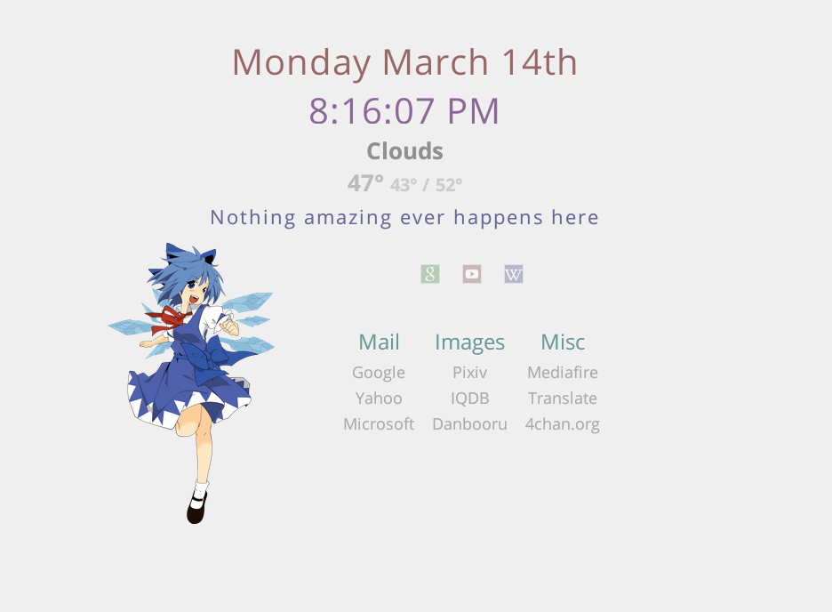

Homepage
====



This repository contains a custom homepage made using html, css and javascript (jQuery). Feel free to download and modify. Comments and suggestions appreciated. Please don't expect too much.

Features:
* Column style links, by category
* Flashy Slidy searchbars
* Randomly selected cute 2D girls
* Light color theme. See [Live Demo](http://gokoururi.github.io/homepage/index-light.html)
* 50 Mascots
* Current day and time
* Weather by location

Customizing, adding mascots and themes
----
To change current theme, replace its name in [home.html](home.html#L15-17)

To customize mascots in `ruri-light` theme, modify the array in [themes/ruri-light/mascots.js](themes/ruri-light/mascots.js):
```javascript
var mascotList = [ "1.png", "2.png", "3.png" ];
```

For accurate temperatures, edit "weather.js" and change the search query to the closest city or zip code near you.
```javascript
var json_url = "http://api.openweathermap.org/data/2.5/weather?q=60646,ma&appid=6e131a2916d5d45d8367b72a4675be0a";
```

To make new theme, you can copy an existing one, and change images and [colors.css](themes/ruri-light/colors.css) as you like.  
Please note that entries in your theme's [mascots.js](themes/ruri-light/mascots.js) should match with contents of [mascots/](themes/ruri-light/mascots/) directory.  
(In this fork, all styling data is referenced within /ruri-light)

Disclaimer
----
Images of cute girls were made by Anons from /w/ and stolen from their [Google Drive](https://drive.google.com/folderview?id=0B_VmbVyD4eT3N1VUbGN4Wjd5OVE).
